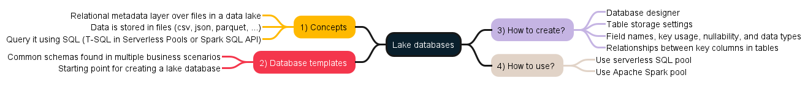

# Azure Data Engineer

- Microsoft Certified: Azure Data Engineer Associate: https://learn.microsoft.com/en-us/credentials/certifications/azure-data-engineer/
- Plan to manage Azure costs:  https://learn.microsoft.com/en-us/azure/cost-management-billing/understand/plan-manage-costs

## 1. Introduction to data engineering on Azure
- Data engineers work with multiple types of data to perform a variety of data operations using a range of tools and scripting language. 
  - Types of data: Structured, Unstructured, Semi-structured. 
  - Data Operations: Integrations, Transformation, Consolidation
  - Languague: SQL, Python, Others
- Important data engineering concepts:
  - Opearational and analytical data: Transaction data used by applications, Optimized for analysis and reporting. 
  - Streaming data: Perpetual, real-time data feeds. 
  - Data pipeline: Orchestrated activities to transfer and transform data. Used to implement ETL or ELT operations. 
  - Data Lake: Unstructured/Analytical data stored in files distributed storage for massive scalibility. 
  - Data Warehouse: Analytical data in RDBS typically modeled as a star schema to optimize summary analysis
  - Apache Spark: OS engine for distributed data processing
- Data engineeing in Azure
  - Operaation Data > Data Ingestion/ETL > Analytical data storage and Processing > Data modeling and visualization. 

## 2. Introduction to Azure Data Lake Storage Gen2
- Data Lake Storages Gen2
  - Distributed cloud storage for data lakes
  - Azure Data Lake storage stores data in HDFS-compatability common file system for Handoop, Spark and others. 
  - Flexible security through folder and files level permission. 
  - Built on Azure storages: High performance and scalability, Data redundancy through built-in replication. 
  - By enabling Hierarchical namespace will enable to use Azure Data Lake Stograge Gen2

## 3. Introduction to Azure Synapse Analytics
- Azure Synapse Analytics is a cloud platform for data analytics
  - Large-scale data warehousing
  - Advanced analytics
  - Data exploration and discovery
  - Real time analytics, Data integration, Integrated analytics
  - [Explore Azure Synapse Analytics:](aka.ms/mslearn-explore-synapse)
  - Pipelines allows to move data from one to another. 
  - Dedicated SQL Pool allows to create a data warehouse. 
  - Notebook for analyze data by python code with text descriptions. 
  - One of the key tasks you can perform with Azure Synapse Analytics is to define pipelines that transfer (and if necessary, transform) data from a wide range of sources into your workspace for analysis.

## 4. Use Azure Synapse serverless SQL pool to query files in a data lake
- https://aka.ms/mslearn-synapse-sql
- https://aka.ms/mslearn-synapse--transform-sql

## 5. Use Azure Synapse serverless SQL pools to transform data in a data lake

## 6. Create a lake database in Azure Synapse Analytics

- Concept:
  - Relation metadata layer over files in data lake. Data is stored in files(csv, json, parquet)
  - Query it using SQL (T-SQL in Serverless Pools or Spark SQL API)
- How to create: DB designer, Table Storage settings, Fields names, 
- How to use: Using Serverless SQL Pool, Using Apache Spark pool

## 7. Analyze data with Apache Spark in Azure Synapse Analytics
## 8. Transform data with Spark in Azure Synapse Analytics
- Modify and save dataframes
  - Typical oprations on a dataframe (filter rows, modify columns values, derive new columns or drop columns)
  - Save the transformed data (Parquet format)
- Partition data files
  - Partition is an optimization technique that enables Spark to maximize the perfromance across the worker nodes. 
  - Partition the output file(partionBy method)
  - filter perquet files in the query
- Transform data with SQL
  - Define tables and views
  - use SQL query and transform the data. 
  - Query the metastore, drop tables. 
  - Extnernal tables are loosly bound to underlying files and deleting the tables does not delete the file

## 9. Use Delta Lake in Azure Synapse Analytics
- **Delta Lake**
  - Open-source storage layer that adds relation database semantics to Spark Serilization format
  - Benefits: CRUD, Supports ACID transactions (Atomicity, Consistency, Isolation, Durablilty)
  - Data versioning and time travel
  - Support for batch and streaming data
  - Standar formats and interoperability. 
- **Create Delta Lake Tables**
  - Creating Delta Lake table from a dataframe
  - Making condition updates(update, delete, and merge operations)
  - Querying a previous version of data. 
- **Create catalog tables**
  - External vs managed tabels
    - A managed table is defined without a specified location, dropping the table deletes the files. 
    - An external table is defined for a custom file location, dropping the table does not delete the files. 
  - Creating catalog tables
    - From a dataframe (df.write.format("delta))
    - Using SQL (Create TABLE myextTable using DELTA LOCATION '/delta/mytable')
    - Using DataTableBuilder API
- **Use Delta Lake with Streaming Data**
  - Spark Structured streaming 
  - Streaming with Delta lake tables
    - As a streaming source
    - As a streaming sink
- **Use Delta lake in a SQL Pool**
  - Querying delta formatted files with OPENROWSET
  - Querying Catalog tabels. 

## 10. Analyze data in a relational data warehouse
- Design 
  - Star Schema: Fact/Dimension tables
  - Snowflake schema
  - Dedicated SQL Pool - https://learn.microsoft.com/en-us/azure/synapse-analytics/sql-data-warehouse/massively-parallel-processing-mpp-architecture
- Create table
  - creating a dedicated SQL Pool
  - consideration of creating tables
- Load tables
  - COPY Into and considerations
- Query a data warehouse
  - Aggregate measures by dimension attributes. 
  - joins in snowflake tables.
  - using Ranking functions (ROW_Number, Rank, Dense_Rank, TILE)
  - Retriving an approximate count. 

## 11. Load data into a relational data warehouse
- Load Staging tables
- Load dimension tables. 
- Load time dimension tables
- Load slowly changing dimensions
- Load fact tables
- Perform post load optimization (Rebuild indexes, Update statistics)

## 12. Build a data pipeline in Azure Synapse Analytics
- What (Activities, Integration runtime, Linked Services, Datasets)
- How to create (Graphical design interface, Defining with JSON)
- Define data flows (Sources, Transformation)
- Run a pipepline (Immediate, Schedule, Trigger based on an event, Lineage: Integrate Synapse and MS Purview)

## 13. Use Spark Notebooks in an Azure Synapse Pipeline
- https://aka.ms/mslearn-synapse-pipelines

## 14. Plan hybrid transactional and analytical processing (HTAP) using Azure Synapse Analytics
- HTAP Patters
  - OLTP versus OLAP: OLTP(online Transaction processing) helps you manage and process real-time transactions from a single source. OLAP(Online analytical processing) uses historical and aggregated data from multiple sources
  - Azure Synapse Link for Cosmos DB: Azure Synapse Link for Azure Cosmos DB is a cloud-native hybrid transactional analytical processing (HTAP) technology that enables you to run near-real-time analytics over operational data stored in Azure Cosmos DB from Azure Synapse Analytics.
    - Cossmos DB Containner
    - Synapse SQL and Apache Spark runtimes
  - Azure Synapse Link for SQL: Replicates the table data to dedicated SQL Pool. 
  - Azure Syanpase Link for Dataverse: Replicates the data to Azure DL storage Gen2
 - https://aka.ms/mslearn-synapse-cosmos (Lab process below)
   - Configure Synapse Link in Azure Cosmos DB
     - Enable the Synapse Link feature in your Cosmos DB account
     - Create an analytical store container
   - Configure Synapse Link in Azure Synapse Analytics
   - Query Azure Cosmos DB from Azure Synapse Analytics
     - Query Azure Cosmos DB from a Spark pool
     - Query Azure Cosmos DB from a serverless SQL pool
     - Verify data modifications in Cosmos DB are reflected in Synapse

## 15. Implement Azure Synapse Link with Azure Cosmos DB
## 16. Implement Azure Synapse Link for SQL
## 17. Get started with Azure Stream Analytics
  - Data Streams  Examples
    - Real-time clickstream data to provide recommendations. 
    - Telemetry data to remotely monitor manufacturing experiments. 
    - Credit Card transactions to detect fraud. 
  - Characteristics of Stream Processing Solutions. 
    - The source data stream is unbounded
    - Support real-time automation or visualization. 
  - https://aka.ms/mslearn-stream-lab

## 18. Ingest streaming data using Azure Stream Analytics and Azure Synapse Analytics
## 19. Visualize real-time data with Azure Stream Analytics and Power BI
## 20. Introduction to Microsoft Purview
## 21. Integrate Microsoft Purview and Azure Synapse Analytics
## 22. Explore Azure Databricks
## 23. Use Apache Spark in Azure Databricks
## 24. Run Azure Databricks Notebooks with Azure Data Factory